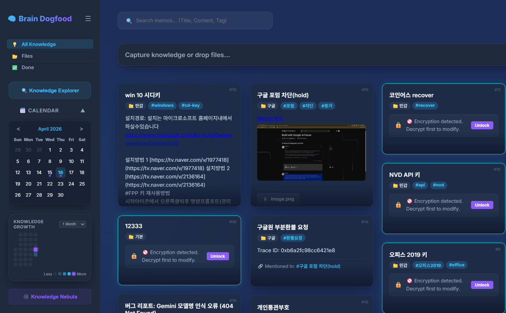

[한국어](#한국어) | [English](#english)

<br/>

<div align="center">
  
  <h1>🧠 뇌사료 (Brain Dogfood)</h1>
  <p><b>지식을 기록하는 습관을 넘어, 지능형 유기체로 성장하는 나만의 지식 창고</b></p>
  <p>Minimalist, AI-powered, Privacy-first Knowledge Server</p>
</div>

---

> [!IMPORTANT]
> **보안 주의사항 (Security Notice)**
> - 기본 관리자 계정은 아이디: `admin` / 비밀번호: `.env` 파일에서 본인이 설정한 값입니다.
> - 최초 로그인 후, 혹은 서버 실행 전 **`.env` 파일에서 `ADMIN_USERNAME`과 `ADMIN_PASSWORD`를 반드시 본인만의 정보로 수정**하세요. 수정하지 않을 경우 보안에 매우 취약해질 수 있습니다.

> [!NOTE]
> **AI 기능은 선택 사항입니다 (AI is Optional)**
> - **Gemini API 키가 없어도** 뇌사료의 핵심 기능(기본 메모, 히트맵, 지식 그래프 Nebula, 개별 암호화 등)은 **모두 정상 작동**합니다.
> - AI 기능(`GEMINI_API_KEY`)은 자동 요약과 인공지능 태깅 기능을 사용할 때만 필요합니다.

---

<h2 id="한국어">📄 프로젝트 소개</h2>

**뇌사료(Brain Dogfood)**는 "내가 만든 지식은 내가 먼저 소비한다"는 철학에서 시작된 개인용 지능형 지식 관리 서버입니다. 단순한 기록을 넘어, AI가 당신의 지식을 분석하고 유기적인 그래프(Nebula)로 연결하며, 주간 단위의 복기를 통해 파편화된 정보를 살아있는 지능체로 진화시킵니다.

또한 사용자의 정보를 절대 해독할 수 없는 **'개별 암호화'** 방식을 지원합니다. **"데이터는 유출될 수 있어도, 내 머릿속의 패스워드는 유출될 수 없다"**는 신념 아래, 설사 서버 데이터가 통째로 탈취당해도 사용자가 설정한 비밀번호 없이는 현대의 기술력으로 해독이 불가능한 강력한 보안을 제공합니다.

### ✨ v8.1+ 독보적인 강점

*   **주간 지식 복기 & 활동량 연동 (Weekly Insight)**: 단순 보관이 아닌 '복기'에 최적화된 인터페이스. 주간 선택기와 활동량 도트(Heatmap Dots)를 통해 이번 주의 지식 성장 흐름을 한눈에 파악하세요.
*   **지능형 지식 네트워크 (Nebula & Visual Linker)**: D3.js 기반의 '지식 성단' 시각화와 **시각적 와이어링(Alt+드래그)** 기능을 통해 아이디어 간의 맥락을 물리적인 선으로 가시화합니다.
*   **관계 포커스 모드 (Relation Focus Mode)**: `Ctrl + Alt + 클릭` 한 번으로 특정 메모와 연결된 모든 지식을 하이라이트하고 화살표로 연결하여 복잡한 지식망 속에서 맥락을 잃지 않게 돕습니다.
*   **하이엔드 UX & 글래스모피즘**: 현대적인 **글래스모피즘(Glassmorphism)** UI와 부드러운 마이크로 애니메이션을 적용하여 프리미엄한 사용 경험을 제공합니다.
*   **Privacy-First Security**: 메모별 개별 AES-256 암호화를 지원하여 관리자조차 엿볼 수 없는 절대적인 보안을 보장합니다.

---

### 🛠️ 최신 패치 노트 (2026-04-27) - v8.2.0 (Expanded External API & Modularization)
*   **외부 API 모듈화**: `external/` 패키지 구조 도입 및 기능별 모듈 분리로 유지보수성 향상.
*   **통합 테스트 환경 강화**: 고도화된 외부 API 검증 스크립트(`test_external_api.py`) 및 `APITester` 도입.
*   **휴지통 관리 고도화**: 삭제된 메모 전용 UI(Grayscale/Blur) 및 복원/영구삭제 기능 구현.
*   **옵시디언 연동 제어**: `config.json` 설정을 통한 내보내기 버튼 활성화/비활성화 기능 추가.
*   **시스템 안정성 개선**: `config.json` 문법 오류 감지 강화 및 프론트엔드 상태 참조 안전장치 적용.
*   **버그 수정**: 메모 카드 내 누락되었던 백링크(언급됨) 렌더링 복구.

### 🛠️ 패치 노트 (2026-04-24) - v8.1.0 (Update Notification System)
*   **GitHub 연동 지능형 업데이트 감지** 및 알림 배지 시스템 도입.
*   **신규 변경 사항(Changelog) 확인** 및 로그 뷰어 모달 구현.
*   **수동 업데이트 안내 시스템 강화** (Native/Docker 가이드).
*   **구조화된 버전 관리 체계**(`version.json`) 구축.

### 🛠️ 이전 패치 노트 (v5.0 ~ v5.5)
*   **[신규 기능] 주간 매니저 (Weekly View)**: 검색창 하단 주간 선택기 배치 및 활동량 도트 연동.
*   **[신규 기능] 고밀도 리스트 레이아웃**: 대량의 지식을 빠르게 훑을 수 있는 수평 콤팩트 모드 추가.
*   **[UI/UX] 세션 타임아웃 카운트다운**: 로그아웃 버튼 내 실시간 잔여 시간 표시 및 지능형 연장 기능.

### 🛠️ 패치 노트 (2026-04-20)
*   **세션 타임아웃 카운트다운**: 로그아웃 버튼에 실시간 세션 남은 시간을 표시하는 타이머를 추가하여 예기치 않은 로그아웃으로 인한 데이터 유실을 방지합니다.
*   **버튼 UI 최적화**: 타이머 표시 공간을 확보하기 위해 로그아웃 버튼 텍스트를 "종료" / "EXIT"로 축약하였습니다.
*   **지능형 세션 연장**: 클릭이나 키보드 입력 등 사용자 활동이 감지되면 타이머가 자동으로 초기화되어 세션이 유지됩니다.

### 🛠️ 패치 노트 (2026-04-19)
*   **파일 첨부 접근성 개선**: 지식 작성기(Composer)에 명시적인 파일 첨부(📎) 버튼을 추가했습니다. (드래그 앤 드롭과 병행 가능)
*   **모바일 UX 최적화**: 모바일 기기에서도 조작이 편리하도록 "파일추가" 텍스트 레이블을 추가했습니다.
*   **다국어 지원 안정화**: 첨부파일 관련 툴팁 및 레이블에 한/영 i18n을 적용했습니다.

---

## 🆚 memos vs 뇌사료 (Comparison)

| 기능 | **memos (Open Source)** | **🧠 뇌사료 (Brain Dogfood)** |
| :--- | :--- | :--- |
| **기본 철학** | 타임라인 기반 마이크로 블로깅 | 유기적인 지식 연결 및 AI 통찰 |
| **시각화** | 단순 달력/히트맵 | **D3.js Knowledge Nebula (그래프)** |
| **AI 통합** | 외부 플러그인 의존 | **Gemini 2.0 Native 통합 (자동 요약/태그 / 선택 사항)** |
| **보안** | DB 전체 보안 | **메모별 개별 암호화 (Grain-level Security)** |
| **사용성** | 모바일 앱 위주 | **데스크탑 생산성 최적화 (Slash Commands & Shortcuts)** |
| **디자인** | 미니멀, 정적인 UI | **Modern Glassmorphism & 다이내믹 애니메이션** |

---

## ⌨️ 생산성 단축키

| 동작 | 단축키 | 설명 |
| :--- | :--- | :--- |
| **전역 네비게이션** | `Alt + 1` ~ `9` | 🚀 **왼손의 법칙 (전체, 고정, 오늘, 주간, 파일, 완료, 탐색기, 성단, 설정)** |
| **저장/수정** | `Ctrl + Enter` | 작성한 메모를 즉시 서버에 반영 |
| **새 메모** | `Ctrl + Shift + N` | 언제 어디서든 즉시 작성창 호출 (`Alt + N` / `Alt + ` 동일) |
| **슬래시 명령** | `/` | `/task`, `/ai`, `/h2` 등으로 빠른 서식 지정 |
| **주간 뷰 토글** | `Alt + W` | 📅 검색창 하단 주간 선택기 영역 토글 |
| **즉시 수정** | `e` (Mouse Over) | 카드 위에서 바로 편집 모드로 진입 |
| **비주얼 링커** | `Alt + #ID 클릭` | 지식과 지식을 선으로 잇는 '시각적 와이어링' |
| **관계 포커스** | `Ctrl + Alt + Click` | 🧠 특정 메모와 연결된 지식들만 강조 및 화살표 표시 |
| **도움말** | `?` | ⌨️ 단축키 가이드 모달 열기 |

---

## 🗺️ Vision Roadmap

- [ ] **v3.0 - Neural Mind-Map Mode**: 그룹 필드를 루트 노드로 활용하여 지식의 위계를 한눈에 파악하는 마인드맵 레이아웃 도입.
- [ ] **v4.0 - Fractal Knowledge Deep-Dive**: 무한히 깊어지는 프랙탈 구조의 시각화를 통해 방대한 지식을 입체적으로 탐험하는 인터페이스 구축.
- [ ] **Obsidian Plugin**: 로컬 옵시디언 환경과 뇌사료 서버 간의 실시간 지식 동기화 브릿지.

---

## 🛠️ 시작하기 (Quick Start)

사용자의 환경에 맞춰 두 가지 방법 중 하나를 선택하여 실행할 수 있습니다.

### 방법 1: 네이티브 직접 실행 (권장)

```bash
# 1. 저장소 복제 및 종속성 설치
pip install -r requirements.txt

# 2. .env.example을 .env로 복사 후 설정 수정 (필수)
cp .env.example .env

# 3. 서버 실행
python brain.py
```

### 방법 2: Docker로 실행 (컨테이너)

도커가 설치되어 있다면 아래 명령어로 즉시 서버를 구축할 수 있습니다.

```bash
# 1. .env 설정 완료 후
docker-compose up -d
```
*데이터베이스와 업로드 파일은 호스트의 `data/`, `static/uploads/` 디렉토리에 안전하게 저장됩니다.*

---

## 🌐 접속 방법

서버가 실행되면 브라우저를 통해 다음 주소로 접속할 수 있습니다:

- **로컬 접속 (동일 PC)**: `http://localhost:5093`
- **외부 접속 (타 기기/모바일)**: `http://<서버 IP>:5093`

> [!TIP]
> **포트 설정 변경**:
> 기본 포트(윈도우: 5050, 리눅스: 5093) 외의 다른 포트를 사용하려면 `.env` 파일에서 `PORT=원하는포트` 설정을 추가하세요.

> [!TIP]
> **리눅스에서 서버 IP 확인하기**:
> 터미널에서 `hostname -I` 명령어를 입력하면 현재 서버의 내부 IP 주소를 확인할 수 있습니다.

*`.env` 파일에서 관리자 아이디와 비밀번호를 꼭 수정하고, 필요한 경우에만 `GEMINI_API_KEY`를 등록하세요.*

---

<h2 id="english">🌐 English Description</h2>

### What is Brain Dogfood?
**Brain Dogfood** is a minimalist yet powerful personal knowledge server built on the philosophy: "I consume the knowledge I create." It’s not just a memo app; it’s an **intelligent knowledge ecosystem** that grows with you.

We provide a security model where user data is practically undecipherable. Built on the conviction that **"Data can be leaked, but the password in my head cannot be,"** even if the entire database is compromised, any "grain-level encrypted" notes and attachments remain impossible to decrypt without the specific password known only to you.

> [!IMPORTANT]
> **Security Notice**: 
> Default credentials are set in the `.env` file. **You MUST change `ADMIN_USERNAME` and `ADMIN_PASSWORD`** in your `.env` file before running the server in a public environment.

> [!NOTE]
> **AI is Optional**: 
> All core features (Memos, Heatmap, Knowledge Nebula, Encryption) work perfectly **without an AI API key**. The `GEMINI_API_KEY` is only required for automated summarization and AI tagging.

### Key Features
- **Intelligent Knowledge Network**: Beyond simple notes, build a "Biological Intelligence" through D3.js-powered **Nebula Maps** and **Visual Wiring (Alt+Click)**.
- **Relation Focus Mode**: Highlight all knowledge connected to a specific memo with a single `Ctrl + Alt + Click`. Visualize the flow of information with directional arrows.
- **Human-Centric Linking**: While AI assists in analysis, *you* define the connections. Build high-density **Knowledge Hubs** that mirror your own cognitive patterns.
- **N:N Multi-Link ecosystem**: Support for unlimited bidirectional links between notes, allowing for complex, fractal-like knowledge growth.
- **Grain-level Encryption**: Advanced security for individual memos – your thoughts are encrypted with your master key, invisible even to server admins.
- **Premium Aesthetics**: High-end Glassmorphism UI with smooth micro-animations and production-ready shortcuts.

### 🆕 What's New in v2.0

- **Visual Node Linker**: Wire your ideas by `Alt + Clicking` the #ID badge. The most intuitive way to bridge text and visual structure.
- **Multi-Link Support**: Insert multiple internal links (`[[#ID]]`) to create clusters of networked thought.
- **Instant Edit (e-key)**: Hover over a memo and press `e` to jump straight into editing mode. Zero-click productivity.
- **Drag & Drop Workflow**: Drag memo cards into the composer to instantly insert a semantic reference.

### 🛠️ Patch Notes (2026-04-27) - v8.2.0 (Expanded External API & Modularization)
*   **External API Modularization**: Packages under `external/` for better maintenance.
*   **Enhanced Testing Environment**: Advanced external API verification script (`test_external_api.py`) & `APITester`.
*   **Advanced Trash Management**: Grayscale/Blur UI and Restore/Permanent Delete functionality.
*   **Obsidian Export Control**: Toggle export button visibility via `config.json` settings.
*   **System Stability**: Enhanced config error handling and frontend state safety checks.
*   **Bug Fix**: Restored missing backlink (Mentioned in) rendering on memo cards.

### 🛠️ Patch Notes (2026-04-24) - v8.1.0 (Update Notification System)
*   **Intelligent Update Detection** via GitHub integration with notification badges.
*   **New Changelog Viewer modal** to review updates within the app.
*   **Manual update guide implementation** (Native/Docker instructions).
*   **Structured versioning infrastructure** (`version.json`) implemented.

### 🛠️ Patch Notes (2026-04-23) - v8.0 (Premium Help Revamp)
*   **[New Feature] Premium Help System Revamp**:
    *   Redesigned the help system with 16+ high-resolution guide images and detailed descriptions extracted from source documentation.
    *   Built a modern help UI using **Glassmorphism** themes and interactive animated cards.
    *   Advanced the **Tabbed System (Guide, Shortcuts, Tips)** within the help modal with full multi-language (KO/EN) support.
*   **[UI/UX] Layout Stability Enhancements**:
    *   **Sticky Tabs**: Optimized Flexbox layout to ensure navigation tabs remain persistent at the bottom regardless of content length.
    *   **Dynamic Titles**: Implemented intelligent header updates that reflect the active tab in real-time.
*   **[Documentation] Maintenance Guidelines**:
    *   Added `docs/help_update_guide.md` to outline future help update processes and image extraction automation.
*   **[Optimization] Cache Busting**: Updated versioning for help content to ensure immediate delivery of latest updates.

### 🛠️ Patch Notes (2026-04-22)
*   **Component Architecture Refactoring**: Refactored `MemoCard`, `AttachmentBox`, and `ModalManager` into independent DOM components, maximizing maintainability and extensibility.
*   **Layout Slotting & List View**: Implemented layout slotting for the main content area. Users can now toggle between **Grid** and **List** views from the top bar for quick title-based scanning.
*   **Password Masking & Enhanced Security**: All password inputs are now masked with asterisks (`*`), and a premium Custom Modal has been introduced to replace the native browser `prompt()`.
*   **[UI/UX] Weekly View Refinement & Layout Unity**:
    *   **Style Isolation**: Implemented `wk-` namespace to prevent CSS leakage and ensure visual independence from the sidebar.
    *   **Heatmap Sync**: Synchronized activity dot colors with the sidebar heatmap (Blue-to-Purple) and added level-4 glow effects.
    *   **Grid Alignment**: Achieved pixel-perfect alignment across Calendar, Composer, and Memo Grid using a unified 1200px guideline and flexible masonry columns.
*   **Global Scope Cleanup**: Encapsulated global functions and state previously attached to the `window` object into modules, enhancing system stability.

### 🛠️ Patch Notes (2026-04-20)
- **Session Timeout Countdown**: Added a real-time countdown timer to the logout button to prevent unexpected data loss from session expiration.
- **UI Optimization**: Shortened the logout label to "EXIT" / "종료" to minimize button size and accommodate the countdown timer.
- **Active Session Reset**: The timer automatically resets upon user activity (clicks, key presses), keeping your session active while you work.

### 🛠️ Patch Notes (2026-04-19)
- **Improved Attachment Accessibility**: Added a dedicated Attach File (📎) button to the Composer.
- **Mobile UI Optimization**: Added an "Add File" text label next to the icon on mobile devices for better touch usability.
- **I18n Stabilization**: Implemented full Korean/English translation for all attachment-related UI elements.

---

## 🆚 memos vs Brain Dogfood (Comparison)

| Feature | **memos (Open Source)** | **🧠 Brain Dogfood** |
| :--- | :--- | :--- |
| **Philosophy** | Timeline-based micro-blogging | Organic knowledge linking & AI insights |
| **Visualization** | Basic calendar/heatmap | **D3.js Knowledge Nebula (Graph)** |
| **AI Integration** | Dependent on external plugins | **Native Gemini 2.0 Integration (Auto summary/tagging)** |
| **Security** | Database-wide security | **Grain-level encryption per memo** |
| **Usability** | Mobile-first app | **Desktop productivity optimized (Shortcuts)** |
| **Design** | Minimalist, static UI | **Modern Glassmorphism & Dynamic Animations** |

---

## ⌨️ Productivity Shortcuts

| Action | Shortcut | Description |
| :--- | :--- | :--- |
| **Save/Edit** | `Ctrl + Enter` | Immediately sync memo to server |
| **New Memo** | `Ctrl + Shift + N` | Call the composer from anywhere |
| **Slash Commands** | `/` | Quickly format with `/task`, `/ai`, `/h2`, etc. |
| **Explorer** | `Ctrl + Shift + E` | Gain an overview of the knowledge structure |
| **All Knowledge** | `Alt + A` | Reset all filters and view all memos |
| **Toggle Weekly** | `Alt + W` | Toggle the weekly review bar |
| **New Memo** | `Alt + N` | Call the composer from anywhere |
| **Visual Linker** | `Alt + #ID Click` | Connect notes visually via 'Visual Wiring' |
| **Relation Focus** | `Ctrl + Alt + Click` | 🧠 Highlight & arrow connections for specific notes |

---

### Quick Start

Choose one of the methods below to launch the server based on your environment.

#### Method 1: Native Execution (Recommended)

1. Install dependencies: `pip install -r requirements.txt`
2. Create your `.env` from `.env.example` and update your master credentials.
3. Launch the server: `python brain.py`

#### Method 2: Docker Deployment (Container)

If you have Docker installed, you can launch the server instantly:

```bash
docker-compose up -d
```
*Your data and uploads are persistently stored in the `data/` and `static/uploads/` directories on the host.*

---

### 🌐 How to Access
Once the server is running, you can access it via your web browser:

- **Local Access**: `http://localhost:5093`
- **Remote Access (Mobile/Other PCs)**: `http://<Server IP>:5093`

> [!TIP]
> **Changing the Port**:
> To use a port other than the default (Windows: 5050, Linux: 5093), add `PORT=your_port` to your `.env` file.

> [!TIP]
> **Check IP on Linux**:
> Run `hostname -I` in the terminal to find your server's internal IP address.

---
<div align="center">
  <p>Developed with ❤️ for knowledge lovers.</p>
</div>
