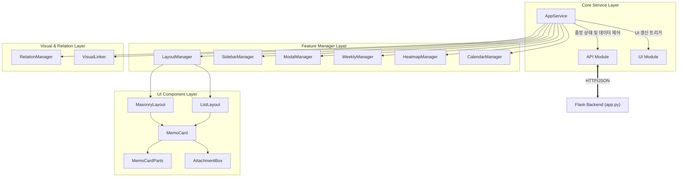

# 🧠 시스템 아키텍처 및 데이터 흐름 가이드 (v8.1+)

이 문서는 뇌사료(Brain Dogfood) 프로젝트의 기술적 구조와 모듈 간의 관계를 정의합니다.

---

## 1. 프론트엔드 모듈 계층 구조 (Hierarchy)

시스템은 **중앙 제어(Service) -> 기능 단위 관리(Manager) -> UI 렌더링(Component)**의 3계층 구조를 가집니다.

---

## 2. 핵심 모듈별 역할 및 입출력 정의

### 🛰️ AppService (The Engine)
- **부모**: 없음 (애플리케이션의 엔트리 포인트)
- **자식**: `API`, `UI`, 모든 `Managers`
- **역할**: 전역 상태(`state`)를 보유하며, 데이터 로딩, 필터 변경, 세션 관리 등 핵심 비즈니스 로직을 오케스트레이션합니다.
- **주요 데이터**: `filters`, `allMemosCache`, `unlockedMemos`

### 📞 API (Data Provider)
- **부모**: `AppService`
- **역할**: 백엔드 API 엔드포인트와 직접 통신하며, HTTP 요청을 수행하고 JSON 결과를 반환합니다.
- **입력**: URL, 요청 Payload
- **출력**: 성공 시 JSON 객체, 실패 시 Error 객체

### 🖼️ UI & LayoutManager (The View)
- **부모**: `AppService`
- **자식**: `LayoutManager`, `MasonryLayout`, `ListLayout`
- **역할**: 메모 카드를 그리드나 리스트 형식으로 렌더링하고, 스크롤 센티넬(Infinite Scroll)을 관리합니다.
- **입력**: 메모 객체 배열 (`memos`)
- **출력**: DOM 구조 생성 및 이벤트 바인딩

### 🧩 Feature Managers (Specialized Tools)
- **WeeklyManager**: 주간 뷰 렌더링 및 날짜 필터 제어.
- **HeatmapManager**: 사용자 활동량(Heatmap) 시각화 및 데이터 동기화.
- **RelationManager**: 메모 간의 연결(Relation) 강조 및 화살표 시각화.
- **ModalManager**: 상세 보기, 설정, 카테고리 관리 등 각종 모달의 생명주기 관리.

---

## 3. 데이터 흐름 (Data Flow Example)

**사용자가 특정 날짜를 클릭했을 때의 흐름:**

1.  **Event**: 사용자가 `WeeklyManager`의 날짜를 클릭합니다.
2.  **Trigger**: `WeeklyManager`가 `AppService.setFilter({ date: '...' })`를 호출합니다.
3.  **State Change**: `AppService`가 내부 상태를 업데이트하고 `API.fetchMemos()`를 요청합니다.
4.  **Data Fetch**: `API` 모듈이 서버로부터 JSON 데이터를 받아 `AppService`로 반환합니다.
5.  **Render**: `AppService`가 `UI.renderMemos()`를 호출하여 화면을 갱신합니다.
6.  **Update**: 관련된 `CalendarManager`, `HeatmapManager` 등도 최신 상태로 `render()`를 재수행합니다.

---

## 4. 백엔드 통신 규약 (API Spec)

- **Base URL**: `/api`
- **Content-Type**: `application/json`
- **Authentication**: 세션 쿠키 기반 (Unauthorized 시 `401` 반환 및 로그인 리다이렉트)

---

## 5. 데이터 식별 체계 (Identification)

시스템은 메모 식별을 위해 두 가지 ID를 병용합니다.

- **Internal ID (Integer)**: 데이터베이스 내의 관계(Foreign Key) 처리를 위한 고유 번호입니다. 성능 최적화를 위해 내부 API 및 DB 조인에 사용됩니다.
- **UUID (String)**: 외부 시스템(Obsidian, 모바일 앱 등)과의 연동 시 사용되는 영구적이고 전역적인 식별자입니다. DB 마이그레이션이나 동기화 시 충돌을 방지하며, 외부 노출용 API의 기본 식별자로 활용됩니다.

---

> [!NOTE]
> 이 아키텍처는 **단방향 데이터 흐름(Unidirectional Data Flow)**을 지향합니다. UI 컴포넌트가 직접 데이터를 수정하지 않고, 항상 `AppService`를 통해 상태를 변경하도록 설계되어 있습니다.
